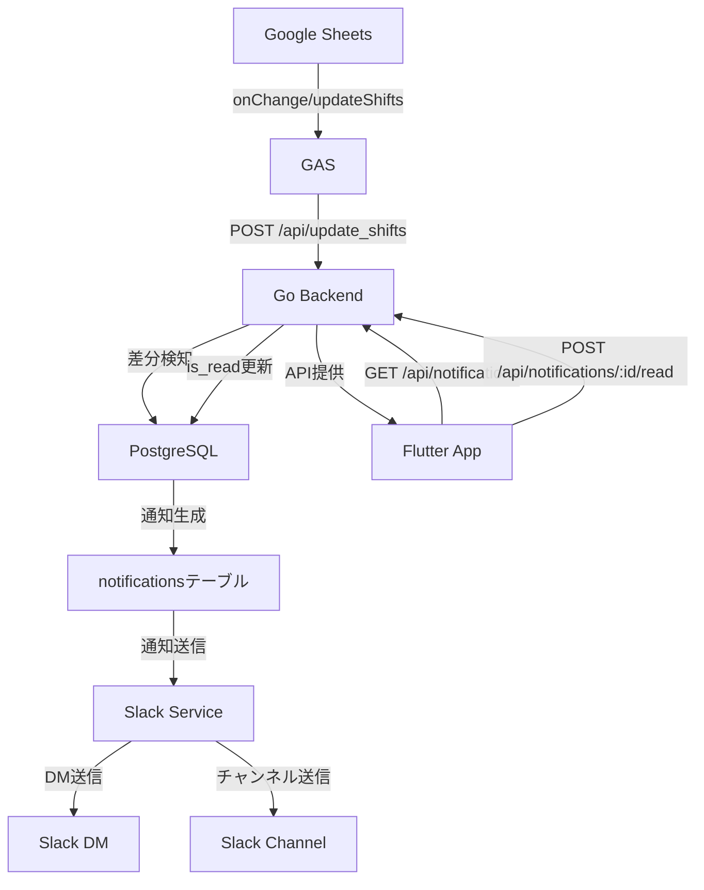

# シフト変更通知システム実装プラン

## プロジェクト構成

モノレポ構成で、以下のディレクトリ構造を採用します：

```javascript
seeft_slackNotification_mock/
├── backend/                    # Goバックエンド（Echo）
│   ├── cmd/
│   │   └── server/
│   │       └── main.go        # エントリーポイント
│   ├── internal/
│   │   ├── config/
│   │   │   └── config.go       # 環境変数読み込み
│   │   ├── database/
│   │   │   ├── connection.go   # DB接続管理
│   │   │   └── migrations/     # マイグレーションファイル
│   │   ├── handler/
│   │   │   ├── shift_handler.go    # シフト更新API
│   │   │   ├── notification_handler.go  # 通知取得API
│   │   │   └── read_handler.go     # 既読API
│   │   ├── model/
│   │   │   ├── shift.go       # シフトデータ構造体
│   │   │   ├── user.go        # ユーザー構造体
│   │   │   └── notification.go # 通知構造体
│   │   ├── repository/
│   │   │   ├── shift_repository.go    # シフトDB操作
│   │   │   └── user_repository.go     # ユーザーDB操作
│   │   └── service/
│   │       ├── shift_service.go       # シフト差分検知ロジック
│   │       └── slack_service.go       # Slack通知送信
│   ├── go.mod
│   └── go.sum
├── frontend/                   # Flutterアプリ
│   ├── lib/
│   │   ├── main.dart
│   │   ├── models/
│   │   │   └── shift_notification.dart
│   │   ├── services/
│   │   │   └── api_service.dart
│   │   └── screens/
│   │       └── notification_list_screen.dart
│   └── pubspec.yaml
├── .env.example                # 環境変数テンプレート
└── README.md
```


## Phase 1: 環境構築とDB設計

### 1.1 環境変数管理（.env.example）

以下の環境変数を定義：

- `DB_HOST`: PostgreSQLホスト
- `DB_PORT`: PostgreSQLポート
- `DB_USER`: データベースユーザー名
- `DB_PASSWORD`: データベースパスワード
- `DB_NAME`: データベース名
- `SLACK_BOT_TOKEN`: Slack Bot User OAuth Token
- `SLACK_CHANNEL_ID`: 通知先チャンネルID
- `API_PORT`: サーバーポート（デフォルト: 8080）

### 1.2 PostgreSQLスキーマ設計

#### usersテーブル

- `id`: SERIAL PRIMARY KEY
- `name`: VARCHAR(255) NOT NULL UNIQUE（スプレッドシート上のユーザー名）
- `slack_user_id`: VARCHAR(255) NOT NULL UNIQUE（Slack User ID）
- `created_at`: TIMESTAMP
- `updated_at`: TIMESTAMP

#### shiftsテーブル

- `id`: SERIAL PRIMARY KEY
- `year_id`: INTEGER NOT NULL
- `time_id`: INTEGER NOT NULL
- `date`: VARCHAR(50) NOT NULL（"準備日", "1日目", "2日目", "片付け日"）
- `weather`: VARCHAR(50) NOT NULL（"晴れ", "雨"）
- `user_id`: INTEGER NOT NULL REFERENCES users(id)
- `task_name`: VARCHAR(255) NOT NULL（空文字も可、'NG'も可）
- `created_at`: TIMESTAMP
- `updated_at`: TIMESTAMP
- UNIQUE制約: (year_id, time_id, date, weather, user_id)

#### notificationsテーブル

- `id`: SERIAL PRIMARY KEY
- `user_id`: INTEGER NOT NULL REFERENCES users(id)
- `shift_id`: INTEGER NOT NULL REFERENCES shifts(id)
- `year_id`: INTEGER NOT NULL
- `time_id`: INTEGER NOT NULL
- `date`: VARCHAR(50) NOT NULL
- `weather`: VARCHAR(50) NOT NULL
- `old_task_name`: VARCHAR(255)
- `new_task_name`: VARCHAR(255) NOT NULL
- `is_read`: BOOLEAN DEFAULT FALSE（Flutterアプリでの既読判定用）
- `slack_dm_sent`: BOOLEAN DEFAULT FALSE
- `slack_channel_sent`: BOOLEAN DEFAULT FALSE
- `created_at`: TIMESTAMP

### 1.3 マイグレーションファイル

SQLファイルまたはGoのマイグレーションライブラリ（golang-migrate等）を使用してスキーマを管理。

## Phase 2: Go APIエンドポイントとDB保存処理

### 2.1 GASからのPOSTリクエスト受信

**エンドポイント**: `POST /api/update_shifts`**リクエストボディ構造**（GASコードに合わせる）:

```json
{
  "changes": [
    {
      "yearID": 43,
      "timeID": 25,
      "date": "1日目",
      "weather": "晴れ",
      "userName": "山田太郎",
      "taskName": "受付"
    }
  ]
}
```

**処理フロー**:

1. リクエストボディをパースして `ShiftChange` 構造体に変換
2. 各changeについて、usersテーブルから `userName` で `user_id` を取得
3. 既存のshiftsレコードを検索（year_id, time_id, date, weather, user_idで）
4. 差分検知：

- レコードが存在しない → 新規作成 + 通知生成
- レコードが存在し、task_nameが異なる → 更新 + 通知生成
- レコードが存在し、task_nameが同じ → 何もしない

5. 差分があった場合、notificationsテーブルにレコードを作成
6. レスポンス: `{"status": "success", "notifications_created": N}`

### 2.2 実装ファイル

- `internal/model/shift.go`: GASからのJSON構造体定義
- `internal/handler/shift_handler.go`: エンドポイント実装
- `internal/repository/shift_repository.go`: DB操作（取得・保存・更新）
- `internal/service/shift_service.go`: 差分検知ロジック

## Phase 3: Slack通知ロジック

### 3.1 通知送信タイミング

Phase 2でnotificationsテーブルにレコードが作成された後、即座にSlack通知を送信。

### 3.2 通知先

1. **DM（Direct Message）**: 変更があったユーザー本人に送信

- `users.slack_user_id` を使用してDMを送信

2. **チャンネル**: 指定されたSlackチャンネルに送信

- `.env` の `SLACK_CHANNEL_ID` を使用

### 3.3 Block Kitメッセージ設計

以下の情報を含む見やすいメッセージを構成：

- ユーザー名
- 日付・天気
- 時刻（timeIDから算出）
- 変更前のタスク名（変更の場合）
- 変更後のタスク名
- 変更タイプ（新規 / 変更）

### 3.4 実装ファイル

- `internal/service/slack_service.go`: Slack API呼び出し
- `internal/handler/shift_handler.go`: 通知送信処理の統合

**使用ライブラリ**: `github.com/slack-go/slack`

## Phase 4: Flutterアプリ実装

### 4.1 APIエンドポイント

- `GET /api/notifications`: 未読通知一覧取得
- `POST /api/notifications/:id/read`: 既読API

### 4.2 Flutter実装

- **通知一覧画面**: 未読通知を強調表示（枠色等で視覚的に区別）
- **詳細画面**: 通知の詳細情報を表示
- **既読処理**: 詳細画面を開いた際に自動で既読APIを呼び出し

### 4.3 実装ファイル

- `internal/handler/notification_handler.go`: 通知取得API
- `internal/handler/read_handler.go`: 既読API
- `frontend/lib/`: Flutterアプリの実装

## データフロー図




## 技術スタック詳細

- **Go**: 1.21+
- **Echo**: v4.x
- **PostgreSQL**: 14+
- **Slack SDK**: github.com/slack-go/slack
- **DB接続**: github.com/lib/pq または github.com/jackc/pgx
- **環境変数**: github.com/joho/godotenv

